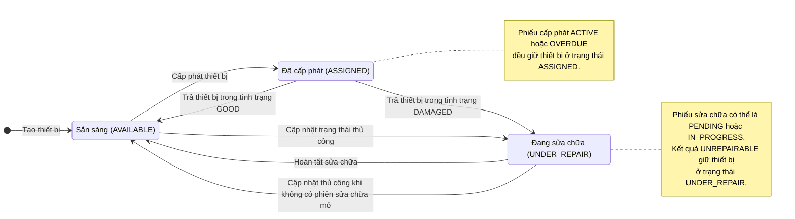
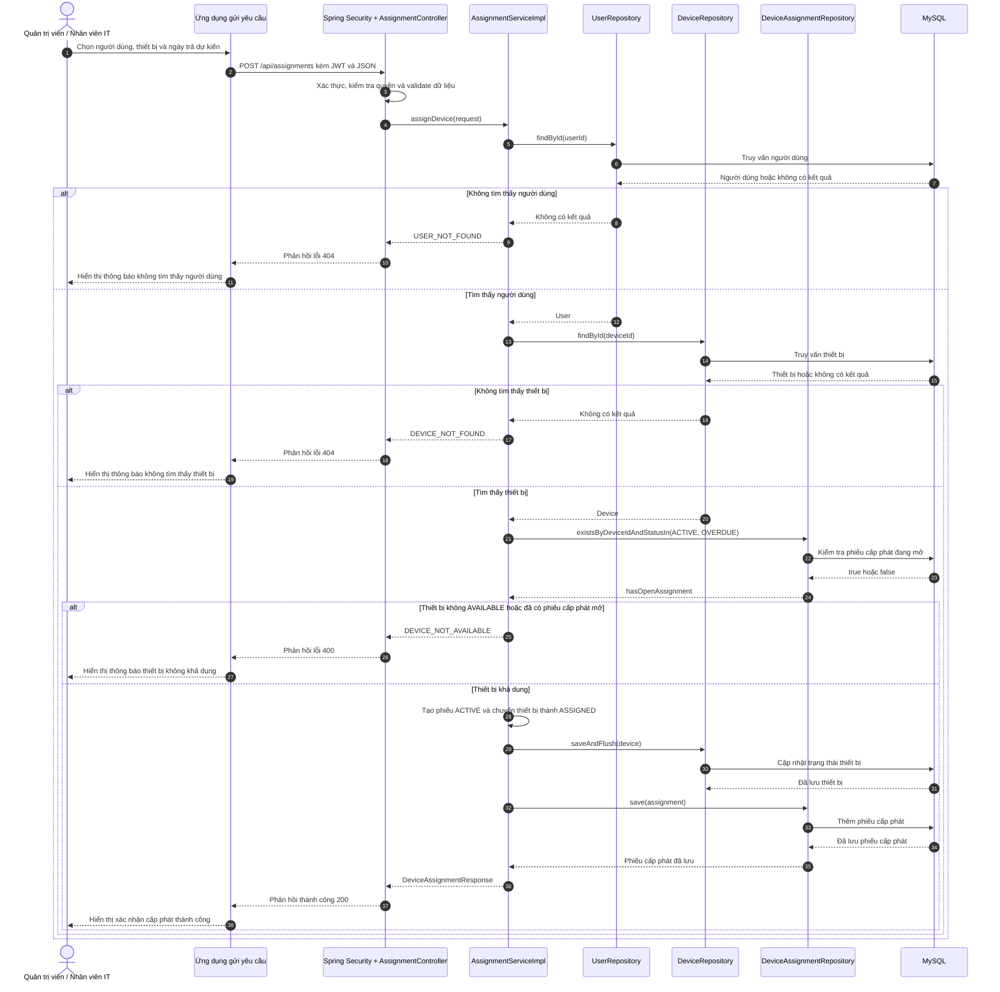

# Sơ đồ hệ thống quản lý thiết bị

Các sơ đồ dưới đây mô tả vòng đời thiết bị và luồng cấp phát đang được backend
triển khai. Tài liệu chỉ sử dụng những trạng thái và chuyển đổi thực sự tồn tại
trong source code.

## Luồng trạng thái thiết bị

### Quy tắc chuyển trạng thái

- `ASSIGNED` do luồng cấp phát quản lý và không thể được chọn trực tiếp qua API
  cập nhật trạng thái thiết bị thông thường.
- Chỉ có thể cấp phát thiết bị đang ở trạng thái `AVAILABLE` và không có phiếu
  cấp phát `ACTIVE` hoặc `OVERDUE`.
- Trả thiết bị trong tình trạng `GOOD` sẽ chuyển thiết bị thành `AVAILABLE`;
  tình trạng `DAMAGED` sẽ chuyển thiết bị thành `UNDER_REPAIR`.
- Khi có phiếu sửa chữa đang mở (`PENDING` hoặc `IN_PROGRESS`), hệ thống không
  cho phép cập nhật trạng thái thiết bị thủ công.
- Hoàn tất sửa chữa sẽ chuyển thiết bị thành `AVAILABLE`. Đánh dấu không thể sửa
  (`UNREPAIRABLE`) sẽ giữ thiết bị ở trạng thái `UNDER_REPAIR`.
- Mô hình hiện tại chưa có trạng thái thanh lý hoặc ngừng sử dụng thiết bị.

## Sơ đồ tuần tự: cấp phát thiết bị
Endpoint: `POST /api/assignments`

Vai trò được phép: `ADMIN` hoặc `IT_STAFF`

Dữ liệu bắt buộc: `userId`, `deviceId` và thời điểm trả dự kiến trong tương lai
`expectedReturnAt`.

Phương thức service chạy trong transaction. Nếu quá trình lưu dữ liệu thất bại,
việc đổi trạng thái thiết bị và tạo phiếu cấp phát sẽ được rollback cùng nhau.

## Source code tham chiếu

- `src/main/java/com/example/device/enums/DeviceState.java`
- `src/main/java/com/example/device/controller/AssignmentController.java`
- `src/main/java/com/example/device/service/impl/AssignmentServiceImpl.java`
- `src/main/java/com/example/device/service/impl/DeviceServiceImpl.java`
- `src/main/java/com/example/device/service/impl/DeviceRepairServiceImpl.java`
